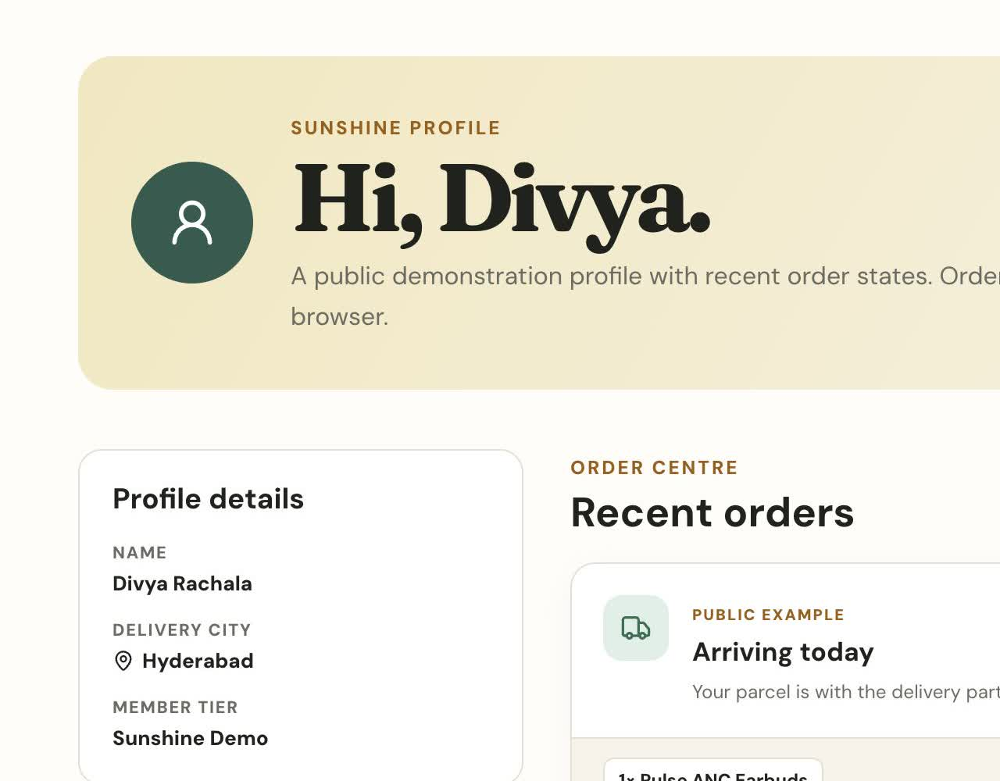
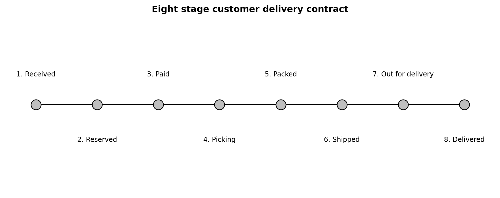

# Sunshine Retail Platform

Sunshine is an Indian retail application that I built to connect product discovery, conversational shopping, cart management, checkout, order processing, delivery updates and retail analytics in one project.

The application contains a Next.js storefront, a Java Spring Boot order service, a Python FastAPI recommendation service and a small pandas analytics workflow. All catalogue, payment and order data is synthetic. No real payment is collected.

Author: Divya Rachala

Live application: [Sunshine](https://sunshine-agentic-retail.vercel.app)

<p align="center">
  
</p>

<p align="center"><em>Figure 1. Sunshine storefront and catalogue entry point.</em></p>

## 1. Project overview

Sunshine provides a complete shopping prototype for customers in India. The catalogue contains 50 products across women’s fashion, men’s fashion, footwear and bags, electronics, and home and living. Prices are displayed in Indian rupees. Delivery rules, address fields and payment choices follow the Indian retail context.

### 1.1 Problem and purpose

Many small commerce projects stop after product listing, cart and checkout screens. The customer support conversation, stock decision, payment result, delivery update and order history often use separate sample data, so the full journey cannot be followed or verified.

The root cause is disconnected application state. A recommendation may not match the real catalogue, a support response may invent an order update, and a failed checkout may not explain which step stopped the order.

I built Sunshine to close this gap. The same catalogue, cart, inventory and order records support the storefront, Divya assistant, checkout results and recent orders. The application shows how an ecommerce interface can remain simple for the customer while several focused services coordinate behind it.

The application supports the following customer journey.

1. Search the catalogue or select a category.
2. Review product information, prices, ratings, sizes and delivery estimates.
3. Ask Divya, the conversational shopping assistant, for product suggestions.
4. Select a size and add a suggested product to the cart from the conversation.
5. Review the cart and continue to checkout.
6. Enter an Indian delivery address and select UPI, card or cash on delivery.
7. Complete a simulated order result.
8. Follow the order through received, reserved, paid, picking, packed, shipped, out for delivery and delivered milestones.
9. Review recent orders and delivery updates from the profile menu.

## 2. Customer experience

### 2.1 Conversational shopping

Divya is available from the support button and the profile menu. The assistant can understand product requests, ask for missing preferences, recommend catalogue items, add a selected size to the cart and provide verified order information.

Example conversation:

```text
Customer: I want nice sneakers.

Divya: Tell me whether they are for women, men or unisex, whether you want casual or running shoes, and your size.

Customer: Women, casual, size 7.

Divya: Here are the strongest available options from the Sunshine catalogue.
```

The assistant uses the optional Ollama Cloud model to interpret natural language. Product prices, sizes, stock and order dates always come from Sunshine data. When Ollama is not configured or is unavailable, the built in support logic continues to provide product discovery, cart help and order lookup.

### 2.2 Profile and orders

The profile menu contains Profile, Recent orders, Account, Chat with Divya and Help centre. The category navigation is reserved for shopping categories.

Every visitor can inspect public order examples for the following states.

1. Arriving today
2. Shipment arriving
3. Delivered
4. Payment failed
5. Item unavailable

Orders placed by a visitor are stored in that browser and appear before the public examples.

<p align="center">
  
</p>

<p align="center"><em>Figure 2. Profile navigation and saved order states.</em></p>

### 2.3 Order journey and inventory behaviour

The catalogue contains normal, low stock and unavailable products. Checkout performs a final availability check before payment and records one of three inventory outcomes.

| Checkout result | Inventory transition | Customer result |
| --- | --- | --- |
| Payment succeeds | Available to reserved to committed | Stock is reduced and an eight stage delivery journey is created |
| Payment fails | Available to reserved to released | Stock returns to its earlier value and no shipment is created |
| Quantity is unavailable | Available to rejected | Payment is not attempted and later stages are stopped |

The order page shows all eight customer milestones and a clear before, held and after stock summary for each line item. A confirmed purchase reduces inventory in the current browser. When the final unit is purchased, the product becomes unavailable on the next visit.

<p align="center">
  
</p>

<p align="center"><em>Figure 3. The delivery contract used by successful orders.</em></p>

## 3. Application architecture

The runtime follows this sequence.

1. The customer uses the Next.js storefront in a browser.
2. The storefront sends conversational requests to the customer support route.
3. Ollama can interpret the request, while Sunshine retrieves verified product, cart and order information.
4. Order requests use the Spring Boot service or the compatible hosted adapter.
5. Recommendation requests use the FastAPI service or the compatible hosted adapter.
6. The pandas workflow reads raw order records and produces the retail KPI report.

The Next.js route handlers provide stable application endpoints. When the Java and Python service URLs are configured, requests are passed to those services. The Vercel deployment can use contract compatible TypeScript adapters when the external services are not available.

The conversational support route follows a separate boundary. Ollama interprets customer language and chooses a supported action. Sunshine then executes that action using verified catalogue, cart and order data.

More information is available in [architecture documentation](docs/ARCHITECTURE.md) and [API documentation](docs/API_CONTRACTS.md).

## 4. Backend services and technology

The backend is divided by responsibility instead of placing every rule in the Next.js interface.

| Service | Main technology | Owned responsibility | Verification |
| --- | --- | --- | --- |
| Order API | Java 17 and Spring Boot 4 | Request validation, order coordination and typed response contract | Four JUnit scenarios |
| Inventory workflow | Java service components | Reserve, commit, release and reject quantities | Success and failure state assertions |
| Payment and fulfilment | Java service components | Simulated payment result, picking, packing and delivery milestones | Stopping-rule and timeline assertions |
| Recommendation API | Python 3.13 and FastAPI | Deterministic related-product ranking from verified catalogue data | Four pytest cases |
| Retail analytics | Python and pandas | Raw-order validation, confirmation funnel, revenue and average order value | Reproducible KPI JSON and figures |
| Hosted API layer | Next.js route handlers and TypeScript adapters | Stable public contract and environment routing | Fifteen Vitest cases and production build |
| Conversational boundary | Ollama Cloud with local fallback | Supported intent interpretation only | Scope, catalogue and order-lookup tests |

The Java response includes the order status, per-component trace, inventory before/held/after values and eight customer milestones. Next.js uses the same object for the order page, profile history and Divya order lookup. Python recommendations return only catalogue products and cannot alter payment, inventory or delivery state.

1. The storefront uses Next.js 16, React 19, TypeScript and CSS for pages, product discovery, cart, checkout, profile and the chat interface.
2. Conversational support uses Ollama Cloud and TypeScript for natural language intent selection with verified application actions.
3. The order service uses Java 17 and Spring Boot 4 for validation, stock decisions, payment simulation and delivery planning.
4. The recommendation service uses Python 3.13 and FastAPI for deterministic content based product ranking.
5. The analytics workflow uses pandas for raw order cleaning, KPI calculation and JSON output.
6. Quality checks use Vitest, JUnit, pytest and ESLint.
7. Delivery uses Docker Compose, GitHub Actions and Vercel.

## 5. Order processing

The Java order service implements a compact multi agent order workflow. Six deterministic agents have one responsibility each: catalogue and inventory, risk, payment, fulfilment, delivery and notification. `OrderOrchestrator` passes typed results from one agent to the next and stops later work when a required step fails.

These agents do not use a language model. They are focused software components that make the sequence, failure rules and service boundaries easy to test. Divya is the separate customer facing AI assistant. This distinction keeps the project description accurate.

The technical workflow remains in the source code and documentation. The shopping interface translates those internal decisions into customer language and never exposes agent names in normal navigation.

The order service supports three controlled checkout results.

1. A successful order commits the reserved quantity, produces a delivery estimate and creates an eight stage tracking timeline.
2. A declined payment releases the reserved quantity, creates no shipment and keeps the cart available.
3. An unavailable item rejects the reservation, stops before payment and records the failed attempt.

### 5.1 Responsibility handoff

| Order phase | Responsible component | Inventory effect | Customer evidence |
| --- | --- | --- | --- |
| Request accepted | Order Orchestrator | No quantity change | Order received |
| Availability check | Catalogue Agent | Available units become reserved | Items reserved |
| Rule review | Risk Agent | Reservation remains held | Processing continues or stops |
| Payment | Payment Agent | Reservation is committed or released | Payment confirmed or declined |
| Preparation | Fulfilment Agent | Committed stock belongs to the order | Picking and packed |
| Transport | Delivery Agent | No further stock change | Shipped, out for delivery and delivered |
| Final update | Notification Agent | Final disposition is recorded | Order history and assistant lookup |

## 6. Product recommendations

The FastAPI service ranks related products from the same category. The scoring method combines product rating and relative price distance.

```text
score = rating multiplied by 2, then reduced by the absolute price difference divided by the reference price
```

## 7. Retail analytics

The analytics workflow reads a synthetic raw order file, validates the records and creates a reproducible KPI file at `reports/retail_kpis.json`.

1. Orders received: 12
2. Orders confirmed: 9
3. Confirmation rate: 75.0%
4. Confirmed revenue: ₹37,136
5. Average order value: ₹4,126.22
6. Highest revenue city: Delhi
7. Highest revenue category: Electronics

## 8. Local setup

### 8.1 Requirements

1. Node.js 22 or newer
2. Java 17
3. Python 3.13
4. Docker Desktop for the combined setup

### 8.2 Docker Compose

```bash
docker compose up --build
```

Open `http://localhost:3000`.

### 8.3 Individual services

Java service:

```bash
cd backend-java
./mvnw spring-boot:run
```

Python service:

```bash
cd backend-python
python -m venv .venv
source .venv/bin/activate
pip install -r requirements.txt
uvicorn app.main:app --reload
```

Storefront:

```bash
cp .env.example .env.local
npm install
npm run dev
```

The Ollama integration is optional. Add `OLLAMA_API_KEY` as a server environment variable to enable cloud based language understanding. The key must never use the `NEXT_PUBLIC_` prefix.

## 9. Tests

```bash
npm test
npm run lint
npm run build

cd backend-java
./mvnw test

cd backend-python
PYTHONPATH=. pytest -q
```

The verified suite contains 23 tests: 15 TypeScript tests, 4 Java tests and 4 Python tests. The checks cover pricing, delivery fees, conversational product discovery, order lookup, stock exhaustion, inventory commit and release, payment failure, the eight stage delivery contract, recommendation ranking and request validation.

## 10. Data and limitations

1. The catalogue, ratings, prices, 12 row analytics fixture, orders and delivery updates are synthetic.
2. The application does not process real payments.
3. Personal orders, cart content and inventory changes use browser storage.
4. There is no shared production customer database.
5. Ollama usage depends on the configured account limits.
6. The recommendation service does not use personal behavioural data.

## 11. Project report

The [project report](output/pdf/Sunshine_Report.pdf) follows the customer journey through discovery, cart, inventory reservation, payment, fulfilment, delivery, support, analytics and test results.

## 12. Author

Divya Rachala

GitHub: [divyarachala1812](https://github.com/divyarachala1812)

License: [MIT](LICENSE)
