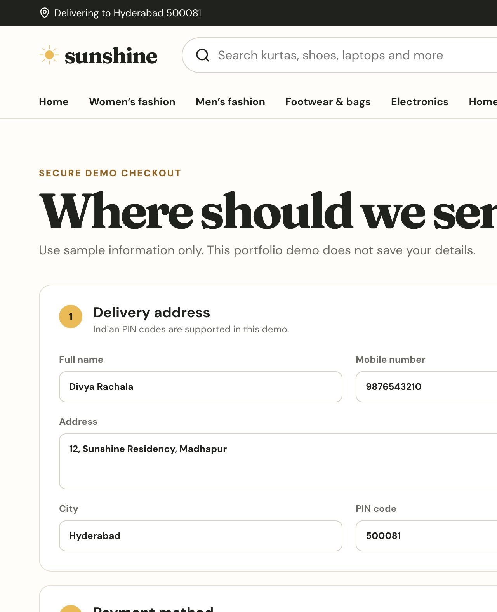
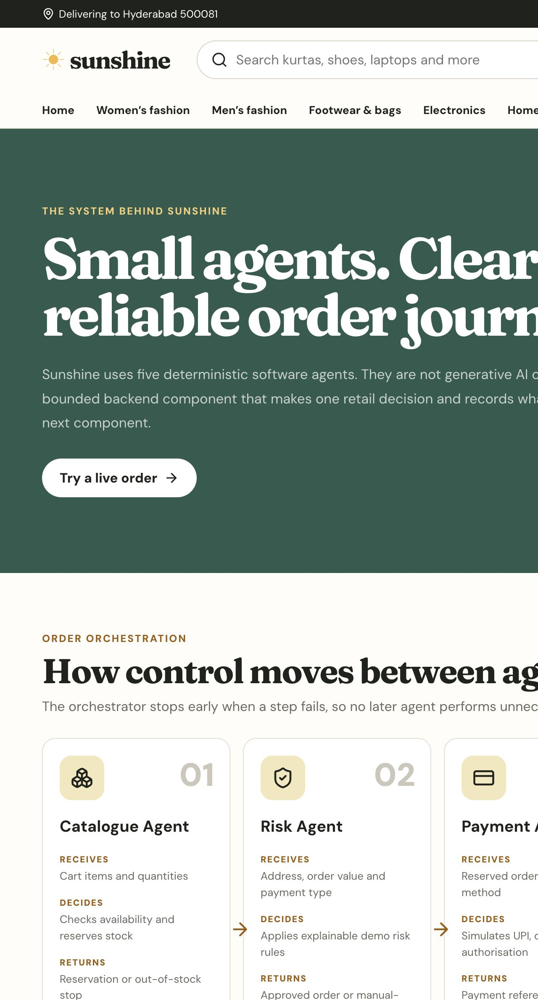
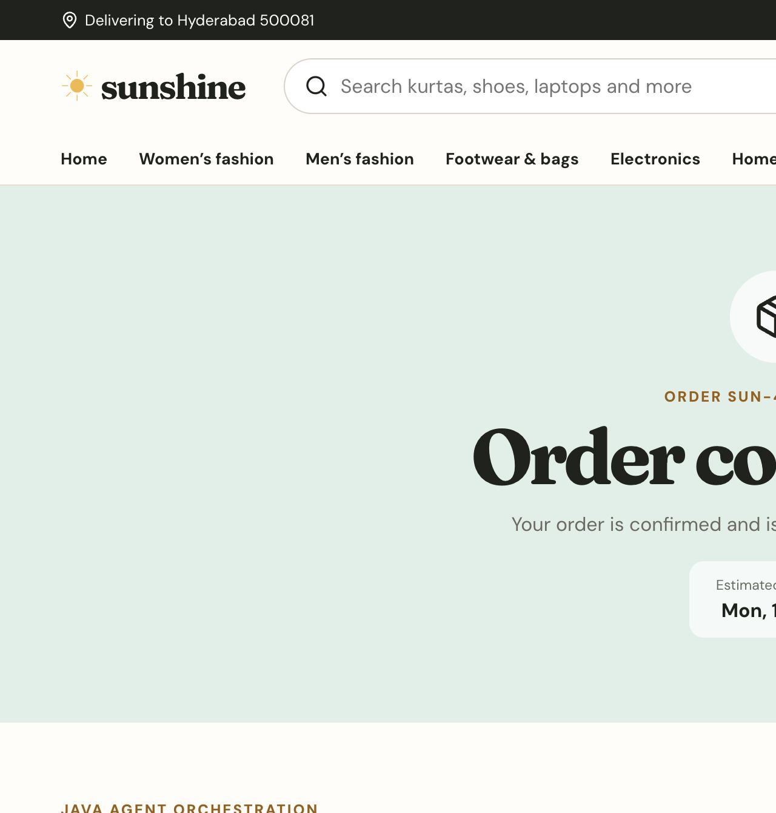
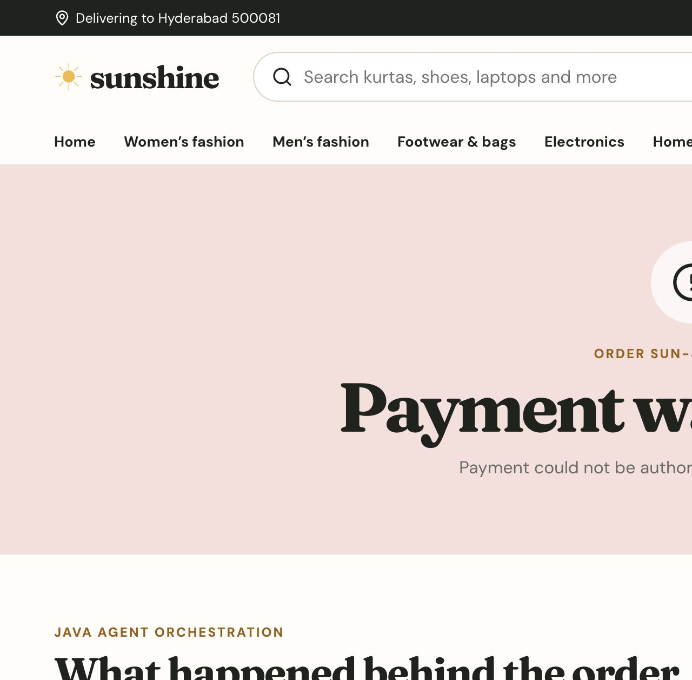
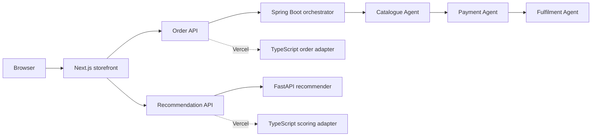

# Sunshine - agent-based Indian retail

Sunshine is an India-first retail portfolio project that takes a shopper from search to order confirmation and makes the backend workflow visible. It combines a responsive Next.js storefront, a Spring Boot order service, a FastAPI recommendation service and a small Python retail analytics pipeline.

Built by **Divya Rachala** as a final-year data science and software portfolio project.

**Live demo:** [sunshine-agentic-retail.vercel.app](https://sunshine-agentic-retail.vercel.app)


## Why I built this

Many student e-commerce projects stop at a product grid. I wanted to show the full path after a customer chooses an item: cart calculations, an Indian delivery address, UPI/card/COD selection, stock checking, payment failure, delivery planning and an auditable order result.

The project focuses on skills I can explain clearly in an interview:

- Frontend development with React, TypeScript, Next.js and responsive CSS.
- Java backend design with Spring Boot, validation, records, services and JUnit.
- Python backend and data work with FastAPI, pandas and pytest.
- Multi-agent orchestration using three bounded retail agents.
- Testing, Docker, GitHub Actions and Vercel deployment.

## Customer experience

- 50 products across women’s fashion, men’s fashion, footwear and bags, electronics, and home and living.
- Search and category filters, Indian rupee prices, discounts and delivery estimates.
- Product detail pages with size selection and content-based recommendations.
- Persistent browser cart with quantity controls and a ₹999 free-delivery threshold.
- Checkout with an Indian address, six-digit PIN code validation and UPI/card/COD choices.
- Three controlled scenarios: successful order, payment declined and out of stock.
- Order number, payment reference, estimated delivery and agent-by-agent trace.

| Product and Python recommendations | Checkout |
|---|---|
|  |  |

## How the agent workflow works

The agents are deterministic backend components, not generative AI chatbots. Each has one bounded responsibility and returns a structured result to the orchestrator.

1. **Catalogue Agent** checks the cart and reserves stock. An out-of-stock result stops the workflow before payment.
2. **Payment Agent** handles UPI, card or COD eligibility. A decline releases the reservation and skips fulfilment.
3. **Fulfilment Agent** plans delivery only after the preceding steps pass.



The successful path returns three completed steps:



The failure path remains visible and explains why fulfilment did not run:



## Architecture



For local development, the Next.js API routes proxy to the real Java and Python services. The public Vercel demo uses matching TypeScript adapters because Java is not an official Vercel Function runtime. This boundary is intentional and documented; the browser contract stays the same in both environments.

See [architecture notes](docs/ARCHITECTURE.md) and [API contracts](docs/API_CONTRACTS.md) for the detailed design.

## Technology map

| Layer | Technology | What it demonstrates |
|---|---|---|
| Storefront | Next.js 16, React 19, TypeScript, CSS | Server/client component boundaries, responsive UI, routing and browser state |
| Hosted API adapters | Next.js route handlers | Validation, proxy/fallback pattern and Vercel compatibility |
| Order backend | Java 17, Spring Boot 4 | Typed records, dependency injection, orchestration, validation and error paths |
| Recommendation backend | Python 3.13, FastAPI | API modelling and deterministic content-based ranking |
| Retail analytics | pandas | Raw CSV cleaning, aggregation and KPI export |
| Quality | Vitest, JUnit, pytest, ESLint | Automated checks across all three application languages |
| Delivery | Docker Compose, GitHub Actions, Vercel | Reproducible local stack and CI/CD |

## Python analytics result

The included raw order sample is intentionally small and synthetic. It proves the data workflow without claiming production volume or using personal customer data.

| KPI | Result |
|---|---:|
| Orders received | 12 |
| Orders confirmed | 9 |
| Confirmation rate | 75.0% |
| Confirmed revenue | ₹37,136 |
| Average order value | ₹4,126.22 |
| Highest-revenue city | Delhi |
| Highest-revenue category | Electronics |

The reproducible output is stored in [`reports/retail_kpis.json`](reports/retail_kpis.json).

## Run locally

### Fastest option: Docker Compose

```bash
docker compose up --build
```

Open `http://localhost:3000`. This starts the Next.js storefront, Spring Boot order service and FastAPI recommendation service together.

### Run each service separately

Requirements: Node.js 22+, Java 17 and Python 3.13.

```bash
# Terminal 1 - Java order service
cd backend-java
./mvnw spring-boot:run

# Terminal 2 - Python recommendation service
cd backend-python
python -m venv .venv
source .venv/bin/activate
pip install -r requirements.txt
uvicorn app.main:app --reload

# Terminal 3 - storefront
cp .env.example .env.local
npm install
npm run dev
```

The Java health endpoint is `http://localhost:8080/api/health`; FastAPI health is `http://localhost:8000/health` and interactive API docs are at `http://localhost:8000/docs`.

## Tests

```bash
# TypeScript logic, lint and production build
npm test
npm run lint
npm run build

# Java orchestration scenarios
cd backend-java && ./mvnw test

# Python recommendation API
cd backend-python && PYTHONPATH=. pytest -q

# Regenerate retail KPIs
cd backend-python && PYTHONPATH=. python scripts/retail_kpis.py
```

Current local verification:

- 6 Vitest tests passed.
- 3 JUnit tests passed.
- 4 pytest tests passed.
- ESLint passed.
- Next.js production build generated 59 pages successfully.
- Browser QA passed for product, cart, checkout, successful payment and declined-payment flows.
- Integration responses confirmed the Java order service and Python recommendation service were actually used.

## Repository guide

```text
sunshine-agentic-retail/
├── src/                    # Next.js storefront and hosted API adapters
├── backend-java/           # Spring Boot order orchestrator and agents
├── backend-python/         # FastAPI recommender and pandas KPI script
├── docs/                   # Architecture, API notes, screenshots and report
├── reports/                # Reproducible analytics output
├── .github/workflows/      # CI for TypeScript, Java and Python
└── docker-compose.yml      # Full local polyglot stack
```

## Honest scope and limitations

- All products, prices, ratings and orders are synthetic demonstrations.
- Payments are simulations and never charge money.
- The cart uses local storage; orders are not persisted in a database.
- Agent durations are illustrative trace values, not performance benchmarks.
- The recommendation model is content-based because no real customer history is collected.
- Authentication and a real gateway are sensible future improvements, but excluded to keep the project credible at final-year student scope.

## Project report

The detailed PDF report in [`output/pdf/Sunshine_Project_Report.pdf`](output/pdf/Sunshine_Project_Report.pdf) covers requirements, architecture, API contracts, data decisions, KPI analysis, test evidence, screenshots, limitations and interview discussion points.

## Author

**Divya Rachala** · Bachelor’s student in Data Science  
GitHub: [divyarachala1812](https://github.com/divyarachala1812)

Released under the [MIT License](LICENSE).
