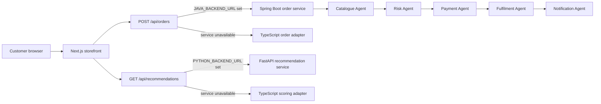

# Sunshine architecture

Sunshine is a student-scale polyglot retail system. It keeps the responsibilities small enough to explain in an interview while still demonstrating a complete customer journey and real service boundaries.

## Runtime flow

The public Vercel deployment uses the two TypeScript adapters because Vercel Functions do not provide a Java runtime. The Java and Python services remain the canonical local service implementations and use the same request and response contracts as the hosted adapters.

## Service responsibilities

| Component | Responsibility | Main evidence |
|---|---|---|
| Next.js frontend | Search, catalogue, product pages, cart, checkout and order trace | `src/app`, `src/components` |
| Spring Boot backend | Order validation and five-agent orchestration | `backend-java/src/main/java` |
| FastAPI backend | Content-based product ranking | `backend-python/app` |
| Python analytics | Reads raw order CSV and produces retail KPIs | `backend-python/scripts/retail_kpis.py` |
| Vercel adapters | Keep the deployed demo functional with matching contracts | `src/app/api` |

## Agent rules

1. The Catalogue Agent runs first. If stock is unavailable, payment and fulfilment are skipped.
2. The Risk Agent applies deterministic address, order-value and payment rules after a reservation.
3. The Payment Agent runs only after the preceding checks. If authorisation fails, reserved stock is released and fulfilment is skipped.
4. The Fulfilment Agent returns an estimated delivery date only for eligible orders.
5. The Notification Agent records an order-history update for success, payment failure or stock failure.
6. Every step returns a trace item containing its name, status, explanation and demonstration duration.

These are deterministic software agents with bounded responsibilities. No large language model is used in the order path.

## Data choices

The 50 products are a curated synthetic catalogue designed for an Indian retail demonstration. Prices, ratings and inventory are fictional. The raw KPI file contains 12 synthetic order records across Indian metro cities. Synthetic data is used so the repository contains no personal customer information or copyrighted product images.

## Deployment boundary

- Vercel: Next.js pages and serverless route handlers.
- Local or container host: Spring Boot and FastAPI services.
- `JAVA_BACKEND_URL` and `PYTHON_BACKEND_URL`: switch the Next.js routes from adapters to real services without changing browser code.
- No database or real payment gateway: the cart, personal order history and per-browser stock simulation use versioned local storage.
- Five seeded order examples are static and visible to every visitor; newly placed attempts remain private to that browser.

## Deliberate limitations

- Authentication, shared database persistence and real payment processing are excluded.
- Stock changes are a browser-local simulation rather than shared warehouse inventory.
- Recommendation scoring is content-based, not collaborative filtering, because no real customer history is collected.
- Agent durations are illustrative values that make the trace easier to read; they are not performance benchmarks.
